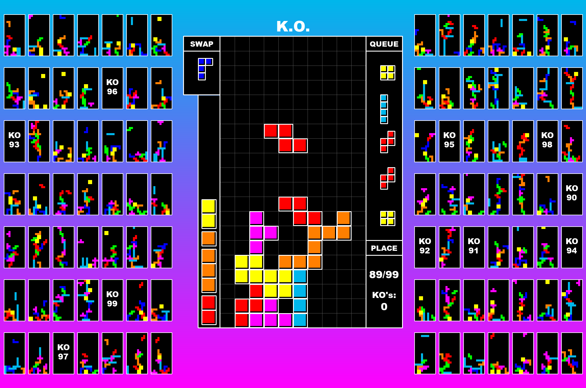
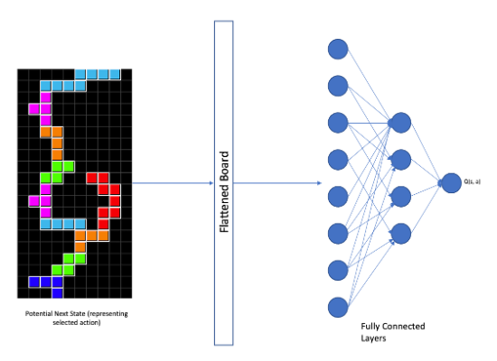
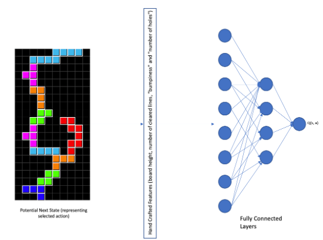
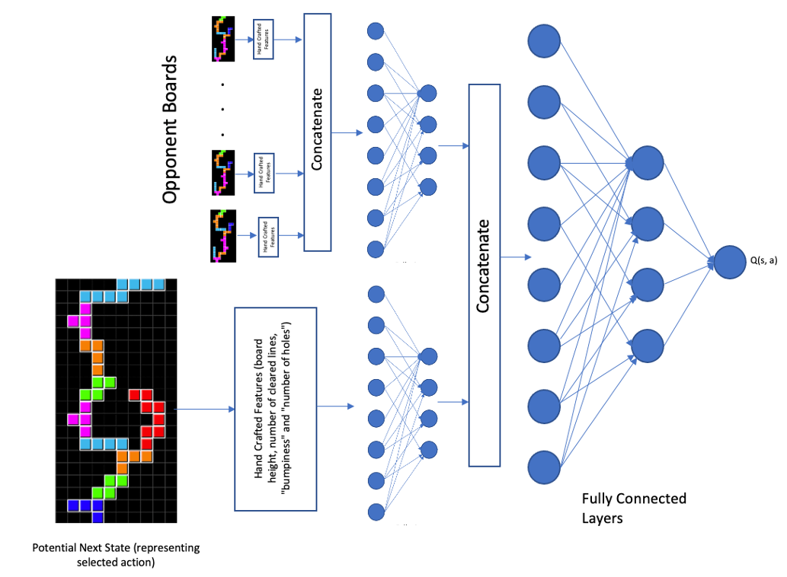
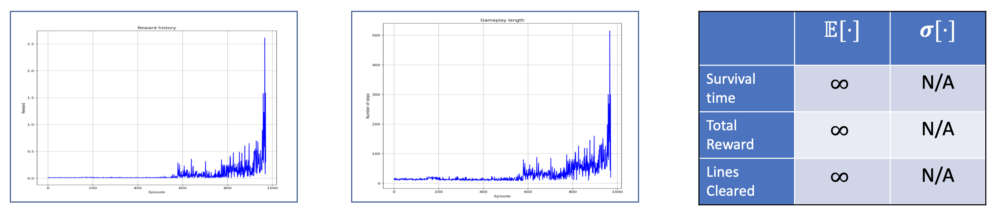
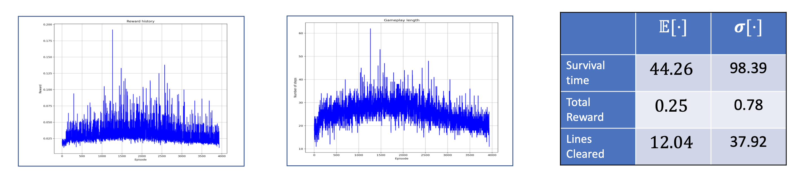
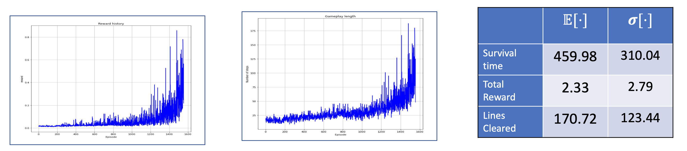
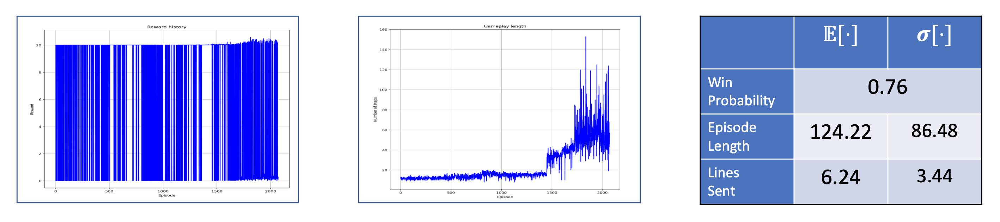
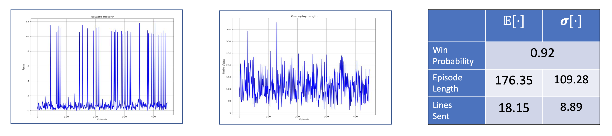

<div align="center">
<h1>Deep-Q and Transfer Learning with Tetris 99</h1>

</div>

## Authors

- [Ian Conceicao](https://github.com/IanConceicao)
- [Suraj Vathsa](https://github.com/svathsa)
- [Viacheslav Inderiakin](https://github.com/SlavaInder)

## Learn More

- [Report](Report.pdf)
- [Poster](Poster.pdf)
- [Short Video Presentation](https://www.dropbox.com/s/1dsti91jigxwq0t/presentation.mp4?dl=0)

## Abstract

Tetris 99 is a multiplayer battle-royal game that extends the classic Tetris gameplay. In this work, we create the game environment, implement training algorithms and optimize reinforcement learning agents to play Tetris 99 at the human level. In particular, we compare the performance of three Neural Network architecture classes: a _Fully Connected Net_, a _Fully Connected Net_ with artificially constructed features and a _Convolutional Neural Network_. We also compare three learning algorithms: _Deep Q-learning_, _Deep Q-learning_ with fixed targets and _Double Deep Q-learning_. In addition, we study how _transfer learning_ affects performance. We show that by using preprocessed features and keeping the model size moderate, we can achieve high performance in both single-player and multiplayer tasks. We also show that transfer learning greatly enhances the model's performance and guides training.

## Introduction

Tetris 99 is a game where 99 players compete to be the last player standing. Each of the players control a standard 20×10 board where they can sequentially place incoming pieces. Completion of certain conditions, for example, clearing 4 rows at once, not only increases score, but also gives an opportunity to attack other players by overloading their boards with incomplete lines called garbage rows, or simply garbage. Our team chose this game over other RL testbeds because it combines four features frequently present in real-life RL problems:

1. Tetris 99 has an enormous state space of more than 2^20 states for the single-player mode and an exponentially higher state space in the multiplayer scenario.
1. The environment is not deterministic.
1. It requires the agent to be aware of the other players and learn a strategy to survive in a competition.
1. Finally, Tetris 99 holds high similarity to its single-player version, which makes the usage of transfer learning possible.

Also, to the best of our knowledge, this game has not been studied before in a reinforcement learning context.

## Methodology

We explored three distinct approaches for Neural Network design:

1. In the first scenario, we pass the raw representation of the players’ boards through several fully connected layers with ReLU activation functions.



2. The second approach utilizes a set of artificially constructed features including: board height, number of cleared lines, "bumpiness" and "number of holes". The artificial features are then passed through several fully connected layers.



3. Finally, we pass the raw board state through a combination of convolutional and fully connected layers, to compensate for the large state space complexity while simultaneously retaining high final performance.
   

We attempted Deep Q-Learning, Deep Q-Learning with fixed targets, and Double Deep Q-Learning with these three architectures and recorded performance results.

Based on results obtained from training vanilla Tetris agents, we observed that fully connected layers with hand crafted features worked best. We used this as an inspiration to design the multiplayer Tetris 99 agents. Because each player has a view of all their opponent's boards, we decide to also feed opponent board features to the fully-connected network.

Key features of this architecture include:

1. Features of interest of the player’s board
1. Features of interest of all the opponent player’s board
1. Equal weight for both opponents’ board features and player’s board features using the latent representation of both inputs

Based on our experiments in single-player (vanilla) Tetris, we attempted to train models for playing Tetris 99. Similar to the network architectures, the algorithms used for reinforcement learning were adopted from vanilla Tetris. Since Deep Q Learning with fixed targets performed best, we used this algorithms for training the (multiplayer) Tetris 99 agent.

We restricted the number of players to two players given the limited time and resources available for training.

We also sought to understand the effects of transfer learning and whether transferring weights learned by an agent playing vanilla Tetris would help boost performance or training speed. To carry out the experiments we trained two different architectures in three scenarios:

1. Both the agent and its opponent start learning from scratch, and opponent’s weights are regularly updated using agent’s
   weights.
1. The multiplayer agent is initialized with random weights and plays against the best single-player agent, whose weights were transferred from the single player scenario.
1. Both the agent and its opponent are initialized using the weights of the most performant agent from the single player scenario; Also, the opponent’s weights are regularly updated using agent’s weights

## Results

Training was monitored using reward accumulated in each episode, the total number of timesteps the episode lasted and the total number of lines that were cleared by the agent. Further, each combination of architecture and algorithm was evaluated for 50 epochs with exploration turned off and the cumulative rewards, average steps per episode, and average number of lines cleared per episode were calculated.



Vanilla Tetris with fully connected layers as Deep Q Network and preprocessed features fed as input. Deep Q Learning with fixed target was used for training.



Vanilla Tetris with Fully connected layers as Deep Q Network and raw flattened board fed as input. Deep Q Learning with fixed target was used for training.



Vanilla Tetris with CNN based Deep Q Network with the raw board as input board. Deep Q Learning with fixed target was used for training.



Two player T99 with agent and opponent trained from scratch



Two Player T99 with agent trained starting with weights transferred from single player agent against an opponent with weights transferred from a single player agent. The opponent’s weights are updated at regular intervals with new weights learned by the agent.

## Conclusion

During the course of this project, we trained RL agents that can play classic single-player Tetris and compete in multiplayer Tetris 99 at human level. We compared the performance of several architectures and training algorithms on both single-player and multiplayer testbeds, and observed that increase in feature complexity strongly increases training time and degrades final performance. However, given a highly representative features and an architecture with sufficient capacity, an agent can be trained to play almost perfectly mimicking human behavior. We also compared how transfer learning affects training in multiplayer scenario. We found that transferring knowledge of game mechanics from single-player scenario to multiplayer is highly beneficial for training the agent in the given number of steps. In the future, we are planning to study ways of transferring knowledge of obtained RL agents for environments that use raw button presses as inputs. We also hope to extend these experiments to T99 with 99 players and observe if the behaviors observed in a two player setting is the same as that observed in a ninety nine player setting.

<div align="center">

</div>

## How to setup the environment:

### 1. Create a python 3.8 virtual environment for the project. If using conda, run:

```
conda create -p name_of_environment python=3.8
```

### 2. Add virtual environment to jupyter notebook search list. If using conda, run:

```
pip install --user ipykernel
python -m ipykernel install --user --name=name_of_environment
```

### 3. Activate environment

```
conda activate ./venv_name
```

### 4. Install libraries

```
pip install -r requirements.txt
```

_Important note_: make sure that all libraries you are installing are listed in `requirements.txt`. This will help others to avoid issues while running your code.
